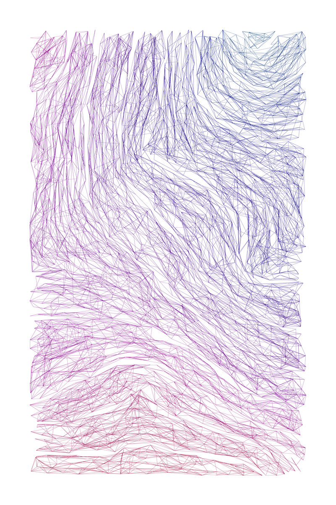

# Coagulate

Coagulate is a generative art project that shamelessly rips off (in a black-box
fashion) [Lammetje's _Intertwine_](https://www.fxhash.xyz/generative/23186)
series. While the original project yields beautiful results, the results are
sold as NFTs. NTFs are a cancer upon society. This project is free software
allowing anyone to use it and generate as many images as they want,
unencumbered by intellectual property rights or artificial digital scarcity.

## Usage

To generate some images, simply run the following commands:

```bash
$ mkdir output
$ poetry install
$ poetry run generate.py
```

Please look inside `generate.py` for possible configuration options. This
project is designed to be highly parameterized, so there is plenty of fun to be
had tweaking them.

## Example output

Here is an example of what this project generates:


